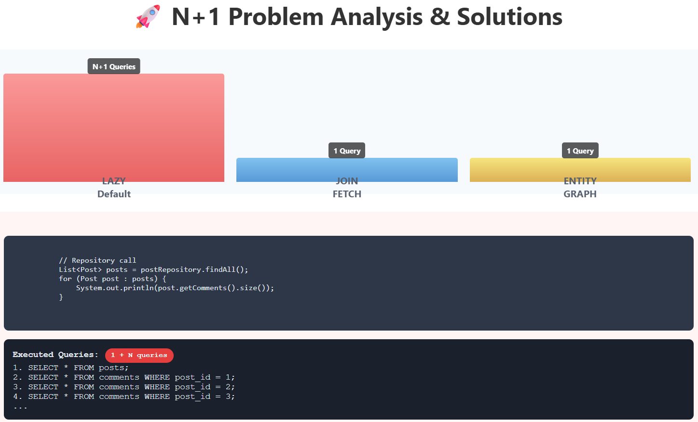
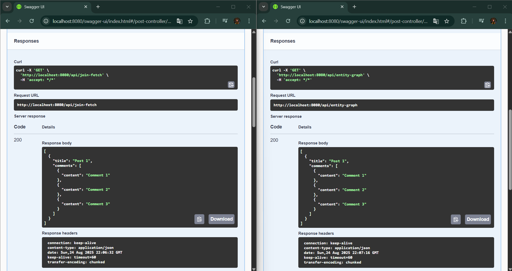
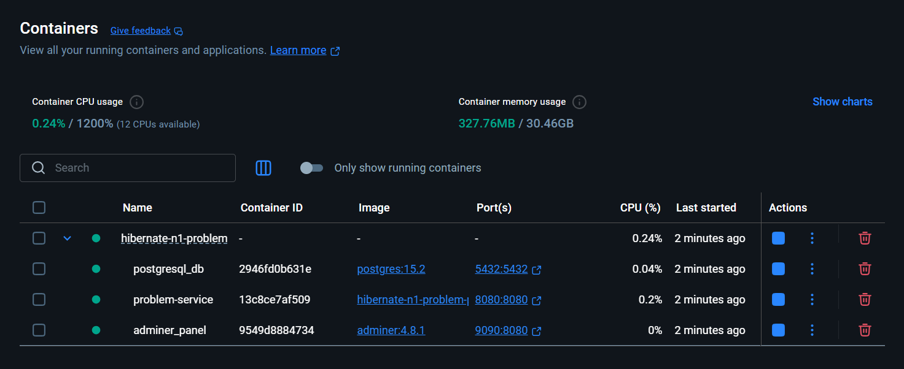

## 🐞 `Spring Boot Hibernate N+1 Problem`

<br>

<div align="center">

</div>

---

<div align="center">

</div>

---

<div align="center">

</div>

<br>

- ✅ This application is a Spring Boot project that focuses on demonstrating the Hibernate N+1 Select Problem - a common performance issue in ORM-based applications. It illustrates how N+1 problems occur during lazy loading of entity relationships and provides practical solutions using fetch joins, DTO projections, and MapStruct for efficient data transfer.

<br>

Used Technologies in The Project:

[](https://www.java.com/en/)
[](https://spring.io/)
[](https://hibernate.org/)
[](https://www.postgresql.org/)
[](https://gradle.org/)
[](https://docs.docker.com/)

<br>

### 🚀 Quick Start
#### Prerequisites
- Java 17+
- Docker & Docker Compose
- PostgreSQL 15.2

#### Database Configuration
- **URL:** `http://localhost:9090` (Adminer)
- **Database:** `problem_db` 
- **Username:** `postgres`
- **Password:** `postgres`

### Installation

```shell
git clone https://github.com/furkankayam/hibernate-n1-problem.git
cd hibernate-n1-problem
```

<br>

### Usage

```shell
docker-compose up
```

#### 3. Access endpoints

- Problem Service: `http://localhost:8080/swagger-ui/index.html`
- Database UI: `http://localhost:9090`

<br>

### 🛒 Problem API Endpoints

> 🔍 Get Posts Entity Graph
```bash
curl -X 'GET' \
  'http://localhost:8080/api/entity-graph' \
  -H 'accept: */*'
```

> 🔍 Get Posts Join Fetch
```bash
curl -X 'GET' \
  'http://localhost:8080/api/join-fetch' \
  -H 'accept: */*'
```


<br>

# License

This project is licensed under the MIT License. See the [LICENSE](LICENSE) file for details

Created by [Mehmet Furkan KAYA](https://www.linkedin.com/in/mehmet-furkan-kaya/)

